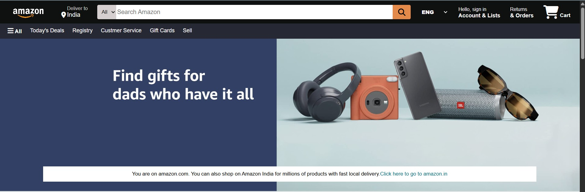
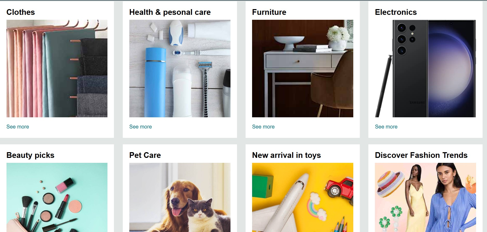
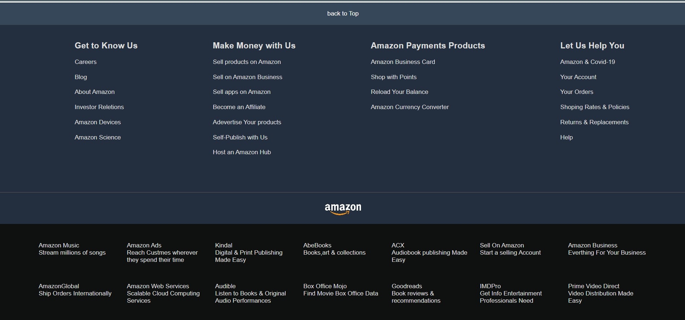

# 📦 Amazon Clone - Static Webpage

This is a **static clone of the Amazon homepage**, built using only **HTML and CSS**. The design mimics the real Amazon website's user interface, showcasing various sections like navigation bar, search bar, product listings, and footer. This project is built solely for **educational and portfolio purposes** and does not contain any backend or real-time functionalities.

---

## 🚀 Features

* Responsive sticky navigation bar with logo and search functionality
* Language and location selectors
* Product category section with hover effects
* Image-based hero section
* Multiple product boxes with category titles and images
* Amazon-style footer with various helpful links
* Clean, scalable layout using Flexbox and CSS transitions

---

## 🛠️ Tech Stack

* **HTML5**
* **CSS3**
* **Font Awesome** (for icons)
* **Images** used locally for various product boxes and sections

---

## 📁 Folder Structure

```
Amazon-Clone/
│
├── index.html              # Main HTML file
├── style.css               # All CSS styles
├── /images                 # Folder containing all image assets
│   ├── amazon_logo.png
│   ├── hero_image.jpg
│   ├── box1_image.jpg
│   ├── box2_image.jpg
│   ├── ...
│   └── cross1.png
```

> 🔔 Ensure you maintain the correct image file names and formats as used in the HTML file. Place all images in the `/images` folder or relative path as per your structure.

---

## 🧾 How to Run

1. Clone or download this repository to your local machine.
2. Make sure all images are available in the same path as referenced in the code.
3. Open `index.html` using any modern browser (Chrome, Edge, Firefox, etc.).
4. Browse the static clone of Amazon homepage.

---

## 📸 Screenshots

### 🔹 Hero Section View


### 🔹 Product Section View


### 🔹 Footer Section View


---

## 📚 Educational Use

This project is intended:

* To practice **HTML/CSS layout structuring**
* To learn how large-scale sites are visually structured
* As a **beginner-level clone project** for frontend developers

> ⚠️ **Disclaimer:** This is not affiliated with Amazon.com in any way. All logos, product names, and designs are used only for demonstration purposes.

---

## 👨‍💻 Author

**Shiwansh Tiwari**
*Frontend Developer & Tech Enthusiast*


